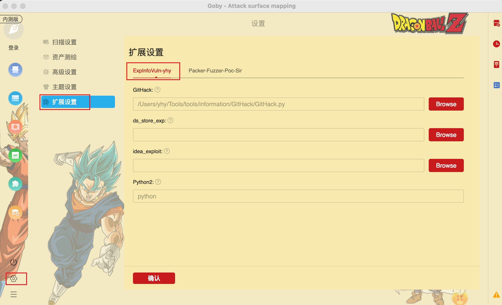
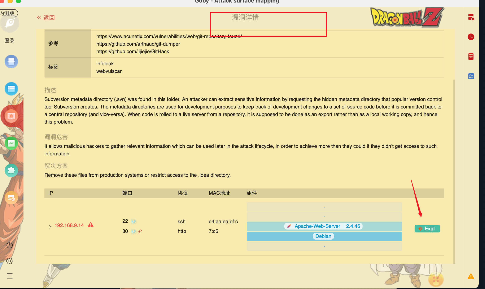

## 快速开始

## 1.下载[idea_exploit](https://github.com/lijiejie/idea_exploit)、[ds_store_exp](https://github.com/lijiejie/ds_store_exp)、[GitHack](https://github.com/lijiejie/GitHack)

您需要前往github仓库下载对应的利用工具https://github.com/lijiejie/idea_exploit.git、https://github.com/lijiejie/ds_store_exp.git、https://github.com/lijiejie/GitHack.git

下载完成后，安装相关依赖pip install -r requirements.txt

## 2. 设置插件

当您下载完毕对应的Goby插件之后，在设置选项您会看到如下内容：

- 关于GitHack：您需要填入您对应GitHack的存放目录；
- 关于idea_exploit：您需要填入您对应idea_exploit的存放目录；
- 关于ds_store_exp：您需要填入您对应ds_store_exp的存放目录；
- 关于Python2：您可以输入`python2`、 `python3.7`、 `/usr/local/bin/python2`等均可，支持绝对路径，但请确保python2已被正确配置。

## 3. 使用本插件

扫描完成后，当存在.idea、 .git、.DS_Store 信息泄露漏洞时，在**漏洞页面**

**漏洞详情**页面

## 4. 开始利用

当一切配置完成后点击按钮即开始调用相应的漏洞利用工具，开始扫描。

当利用完成后，会打开对应的工具目录，方便查看结果（ps: Mac上会同时显示终端运行情况，Windows上不会显示）。

